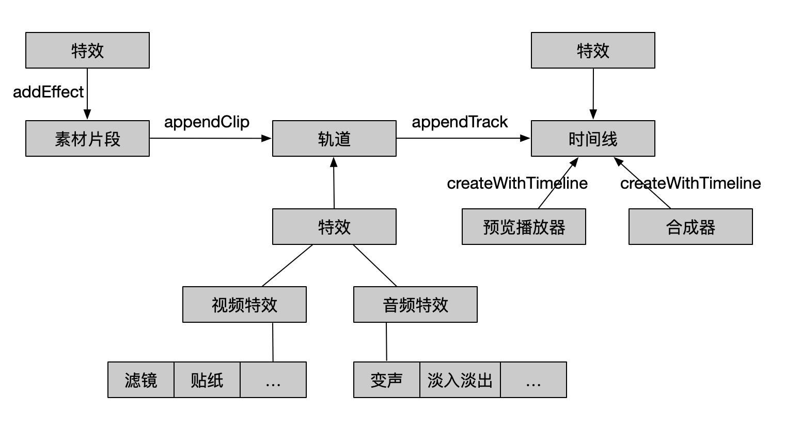

# iOS剪辑SDK接入文档

**目录**

[toc]

## 1. 概述
剪辑SDK定位以市场为导向,助推短视频行业发展，为开发者提供编辑、特效、预览播放、合成全流程解决方案，开发者可以根据自己的创意创建App，实现各种特色功能。

### 1.1 产品特点
**支持多轨道、多段编辑**

* 支持同时导入不同格式的视频、图片，进行多段混剪
* 支持多轨道，能够满足画中画、分屏、配音等多种玩法

**支持多种输入、输出样式**

支持多种格式、多种分辨率的输入素材，素材既可以是本地的也可以是云端url地址，同时开发者可以根据需求自定义输出分辨率。

**所见即所得**

通过预览播放器可以在制作过程中实时预览制作效果，大大提高了制作体验，节省了制作成本和时间

**丰富的基础编辑功能**

剪辑SDK包含丰富的基础编辑功能，开发者可以根据自己的需求灵活组合使用。

**支持自定义特效**

特效完全插件化，开发者还可以根据需要扩展自定义特效。

### 1.2 版本划分

|功能点(标准/商业版版) | 标准版 |商业版 |
|-------------------|-------|------|
|文件导入（图片、视频）|	√	| √
|合成导出	| √ | √
|预览播放器 | √	| √
|移序	| √	| √
|删除	| √	| √
|云端url剪辑	| √ | √
|音视频分离	| √ | √
|背景音乐	| √ | √
|画中画 | √	| √
|转场（基础）| √ | 	√
|缩略图 | √	| √
|渲染模式 |	√	| √
|背景样式(颜色、图片、毛玻璃)	| √| √
|输出码率	| √	| √
|输出分辨率|	√	| √
|输出帧率	| √ | √
|调节音量	| √ | √
|旋转	| √ | √
|镜像	| √ | √
|画面裁剪	| √ | √
|缩放	| √ | √
|变调	| √ | √
|文件变速(变速不变调、变速变调)	| √ | √
|特效-画中画混合模式 |	× | √
|特效-静态字幕 | √	| √
|特效-静态贴纸 |√ | √
|特效-滤镜（基础）| √	| √
|特效-单色调色| √	| √
|特效-二维码、水印 | √	| √
|转场特效（高级）| × | √
|特效-画质 | ×	| √
|特效-字幕、视频、图片关键帧动画 | √ | √ 
|动态贴纸| √ | √
|特效-动态字幕（Ass字幕）| × | √ 
|特效-字幕、视频、图片支持AE轨迹 | √ | √
|特效-变焦（kenburns）| × | √
|特效-马赛克 | √ |	√
|特效-去水印	| × | √
|特效-动效（抖音式特效）| × | √
|音频波形图 | √ | √
|特效-音乐动效（缓入缓出、淡入淡出）| √ | √
|实时效果抽帧| √ | √

|工具 | 标准版 |商业版 |
|-----------|-------|------|
|生成倒放文件	| √ | √
|vp8 webm透明格式文件生成	| √ | √
|生成gif文件	| √ | √

## 2. 功能说明

### 2.1 核心功能说明

| 功能 | 说明 |
| --- | --- |
| 多段合并 | 将多段视频素材拼接一个文件，并且支持剪切头部尾部冗余内容|
| 画面变化 | 对视频画面进行裁剪、旋转、缩放、镜像、添加背景等操作|
| 缩略图 | 实时获取文件缩略图，精确到帧画面，方便剪辑预览 |
| 背景音乐 | 添加背景音乐与原音进行实时混合 |
| 音量调节 | 无级调节音量大小，同时支持添加缓入缓出循序渐进效果|
| 画中画 | 多层画面叠加实现画中画的效果，例如分屏、9宫格画面 |
| 转场 | 相邻文件衔接处添加转场效果，为客户提供60余种效果进行选择 |
| 倍速 | 无级慢速、快速调节，支持1/8-8倍速 |
| 变声 | 调节音调，实现不同的声音效果，例如男声变女声 |
| 字幕、贴纸、水印 | 添加字幕、贴纸、水印丰富视频内容 |
| 动态贴纸 | 支持多张图片帧组成动图序列 |
| 动态字幕 | 支持自定义ass样式字幕 |
| 滤镜 | 添加不同lut快速替换风格，支持自定义 |
| 马赛克 | 针对输入源打马赛克，例如遮盖品牌及广告logo |
| 去水印 | 去除画面固定区域品牌及广告logo |
| 变焦 | 调整画面焦点，也可用于实现kenburns效果 |
| 动效 | 流行的视频动效，例如抖音等平台特效 |
| 画质 | 调整画面质量，例如亮度、对比度、曝光度、饱和度等 |

### 2.2 核心模块说明

剪辑SDK主要分为几个模块，分别为：时间线、特效、预览播放器、合成器。其中时间线内包含音/视频轨道，轨道内包含文件素材，特效。

#### 2.2.1 时间线（Timeline）

* 时间线是所有剪辑事件按照时间先后顺序排列的集合，也是所有剪辑事件在时间上的体现。时间线的长短和最终合成输出的文件时间一一对应，时间线时长即代表最终合成输出文件的时长。

* 理论上，同时可以存在多个时间线实例对象，但对大多数产品来说，同一时间存在一个时间线实例对象即可。

* 添加在时间线上的特效不会随着轨道内容的变化而变化。当时间线被删除时，时间线内的所有内容都会被删除。

|参数          |说明                                        |
|-------------|--------------------------------------------|
|输出分辨率     |必填，预览和合成都需参考                       |
|输出帧率      |默认30帧，预览和合成都会参考                    |
|输出码率      |默认按输出分辨率自动匹配合适码率                 |
|输出文件路径   |合成输出文件路径                              |
|视频帧填充样式 |默认黑边填充                                  |
|视频背景样式   |默认填充黑色背景，仅在视频帧填充样式为背景填充时生效|
|时间线时长    |以时间线内所有轨道结束时间点最大值为结束时间点      |
|倍速         |影响所有素材、特效渲染速度                       |
|音量         |原声的百分比音量，影响所有素材、特效音量           |
|自定义数据    |指针类型，内容用户自定义                       |

|功能             |说明                           |
|------------------|------------------------------|
|初始化||
|释放|会清除所有参数/配置|
|添加轨道||
|删除轨道|根据轨道id删除某轨道|
|获取轨道信息|支持获取单个/所有轨道信息|
|添加时间线特效|位于轨道特效之后处理|
|删除时间线特效|根据特效id删除某特效|
|修改时间线特效|根据特效id修改某特效属性|
|获取时间线特效|支持获取单个/所有时间线特效信息|

#### 2.2.2 轨道（Track）

* 轨道分为顺序轨道和画中画轨道。

* 轨道上可添加、删除、获取文件片段。同一轨道上素材持续时间段不可叠加。添加在轨道上的特效不会随着轨道内素材的变化而变化。当轨道被删除时，添加在轨道上的轨道特效会跟着删除。

* 如果要实现画中画，可以添加两条视频轨道。音频轨道一般用来给视频添加音乐或者配音功能。

* 相邻文件间可以添加转场效果。若素材上已添加转场效果，需先移除转场效果再修改插入时间点。

|参数          |说明                                        |
|-------------|--------------------------------------------|
|轨道ID        |轨道唯一标识		                              |
|轨道类型       |音频或视频		                              |
|轨道排序类型   |顺序轨道/自由轨道                             |
|渲染层级       |默认按轨道ID从小到大顺序渲染                   |
|倍速          |影响轨道上所有素材、特效渲染速度                 |
|音量          |原声的百分比音量，影响轨道上素材、特效音量        |
|渲染信息       |批量设置轨道内clip的渲染信息: 填充样式、背景样式等|
|轨道时长       |以轨道内最后一个文件的结束时刻为结束时间点        |
|自定义数据     |指针类型，内容用户自定义                       |

|轨道排序类型 |功能               |说明                 |
|-----------|------------------|--------------------|
| 顺序轨道    |初始化|依赖时间线对象
|           |释放|会清除轨道上所有参数/配置|
|           |更新素材属性||
|           |根据素材id删除某素材||
|           |获取素材信息|支持获取单个/所有素材信息|
|           |添加素材至轨道末尾||
|           |在指定索引位置插入素材||
|           |移动素材至指定索引位置|素材属性/配置会一起移动|
|           |删除指定索引位置的素材||
|           |获取指定索引位置素材信息||
|           |添加转场|支持设置转场位置、持续时长、样式等|
|           |更新转场属性|支持修改转场位置、持续时长、样式等
|           |删除转场||
|画中画轨道   |添加素材至指定时刻|时刻为相对Timeline的时刻|
|           |修改某素材的插入时刻|时刻为相对Timeline的时刻|

#### 2.2.3 素材片段（Clip）

当素材被删除时，添加在素材上的素材特效会跟着删除。

|参数          |说明                                        |
|-------------|--------------------------------------------|
|素材ID        |素材唯一标识		                              |
|素材类型       |图片、音/视频等                              |
|素材路径      |本地文件提供沙盒路径                           |
|片段裁剪入点  |素材相对于物理文件的开始时间点，图片文件可不填      |
|片段裁剪出点   |素材相对于物理文件的结束时间点，图片文件可不填     |
|插入时间点    |只读，相对于Timeline，素材插入轨道的时刻         |
|倍速          |影响轨素材及素材特效的渲染速度                  |
|音量          |原声的百分比音量，影响素材及素材特效的音量        |
|音调          |在原声的基础上改变音调，默认为0，变调范围-12~12  |
|水平镜像       |默认不镜像                                  |
|垂直镜像       |默认不镜像                                  |
|裁剪区域       |相对源素材的裁剪区域，默认为源素材大小，原点对齐   |
|渲染信息       |默认同track样式，clip和track都设置该属性时按clip属性生效|
|自定义数据     |指针类型，内容用户自定义                       |

|功能             |说明                           |
|------------------|------------------------------|
|初始化             |依赖时间线对象
|添加素材特效        ||
|删除素材特效        |根据特效id删除某特效|
|修改素材特效        ||
|获取素材特效        |支持获取单个/所有特效信息|

#### 2.2.4 特效（Effect）

* 特效是特效的载体，可以针对素材片段、轨道或者时间线添加、获取、删除，特效分为音、视频特效。
* 每个特效包含不同的自有属性，通用属性如下：

|参数          |说明                                        |
|-------------|--------------------------------------------|
|特效ID        |特效唯一标识|
|特效类型      |视频特效、音频特效、图层混合特效|
|开始时间点     |相对被添加对象的开始时间点|
|结束时间点     |相对被添加对象的结束时间点|

|功能         |说明                           |
|------------|------------------------------|
|初始化       |依赖时间线对象
|自定义数据    |指针类型，内容用户自定义

#### 2.2.5 预览播放器（Player）

* 预览播放器和传统播放器相比，具备实时预览效果，所有添加的特效都可以通过预览播放器实时渲染。
* 预览过程中，特效并没有真正添加进源素材文件内。

|功能             |说明                           |
|------------------|------------------------------|
|初始化             |依赖时间线对象|
|释放              | |
|是否处于播放状态    | |
|设置预览画布        | |
|设置预览画布填充模式 | 默认背景填充|
|设置预览画布填充背景色| 16进制值ARGB，默认填充黑色|
|重置播放器         | 播放器初始化后有文件操作均需重置播放器|
|刷新播放器         | 添加特效后实时预览更新效果|
|播放              | |
|停止              | |
|跳转至某个时间点    | |
|获取当前时间戳      | |
|获取当前视频帧      |若添加特效，视频帧为特效处理后的效果|
|错误回调           | |
|播放完成回调        | |
|首帧渲染回调        | |


|需重置播放器的场景：       |
|-----------------------|
|添加、删除轨道           |
|添加、删除素材           |
|变速                    |
|变调                    |
|添加、删除转场，修改转场时长|

|需刷新播放器的场景：      |
|-----------------------|
|修改转场样式、缓动函数类型 |
|添加、删除、修改特效|

#### 2.2.6 合成器（Producer）

* 合成器会读取素材文件，并按特效指令处理素材文件，最终按照配置合成新的媒体文件。

|功能             |说明                           |
|------------------|------------------------------|
|初始化             |依赖时间线对象
|释放              ||
|设置输出地址        ||
|开始合成           || 
|停止合成           |用于打断操作                    |
|合成状态           |进度、状态                      |

#### 2.2.7 缩略图

* 辅助功能，用来获取源素材某个时刻或某段时间内的缩略图。

|功能             |说明                             |
|------------------|---------------------------------|
|初始化             ||
|释放              |会清除临时文件
|批量获取缩略图      |获取文件某时间段内任意数量任意尺寸缩略图|
|获取单张缩略图      |获取文件某时刻任意尺寸缩略图         |

## 3. 接入说明

### 3.1 输入输出规范

**输入规范：**

* 视频格式：MP4、MOV、WMV、M2V、MPG
* 音频格式：MP3、FLAC、AAC、M4A
* 图片格式：JPG、PNG、HEIC
* 视频编码：H264、H265、WMV、MPEG4
* 音频编码：MP3、AAC、PCM、FLAC

**输出规范：**

* 视频格式：MP4
* 视频编码：H264
* 音频编码：AAC

### 3.2 运行环境

* 系统版本：iOS 8.0及以上
* 请在真机上运行，暂不支持模拟器版本

### 3.3 工程配置说明
```
剪辑SDK以framework形式提供SDK动态库，使用时将以下framework加入工程即可:
QHVCEditKit.framework: 剪辑SDK
QHVCCommonKit.framework: 视频云SDK公共库
```

### 3.4 头文件说明

剪辑SDK分为高级版和基础版，高级版本使用时需开通授权：

```code
#import <QHVCEditKit/QHVCEditKit.h>             //头文件列表
#import <QHVCEditKit/QHVCEditDefinitions.h>     //通用定义
#import <QHVCEditKit/QHVCEditConfig.h>          //通用配置
#import <QHVCEditKit/QHVCEditTimeline.h>        //时间线
#import <QHVCEditKit/QHVCEditTrack.h>           //轨道
#import <QHVCEditKit/QHVCEditTrackClip.h>       //素材
#import <QHVCEditKit/QHVCEditEffect.h>          //基础特效
#import <QHVCEditKit/QHVCEditEffect+Advanced.h> //高级特效
#import <QHVCEditKit/QHVCEditPlayer.h>          //预览播放器
#import <QHVCEditKit/QHVCEditProducer.h>        //合成器
#import <QHVCEditKit/QHVCEditThumbnail.h>       //缩略图
#import <QHVCEditKit/QHVCEditTools.h>           //工具
```

### 3.5 使用流程

实现视频编辑的一般步骤：
1. 配置app信息
2. 创建时间线
3. 添加轨道
4. 添加文件片段
5. 添加特效
6. 添加实时预览播放器
7. 合成媒体文件

其中，6、7顺序可颠倒，实时预览、合成器均可单独使用。


### 3.6 注意事项 

* 剪辑基础版功能均为免费，使用前需在云平台配置应用信息
* 剪辑高级版收取一定费用，使用前需获取授权
* 剪辑SDK内所有时间单位均为毫秒

### 3.7 高级功能授权

高级功能使用前需获得授权，可登录官网申请授权https://live.360.cn/
授权方式分为离线授权和云端授权两种，具体使用逻辑可参照demo。

## 4. 代码示例

### 4.1 创建时间线

时间线是剪辑SDK的入口，是剪辑SDK的上下文。在使用剪辑SDK时，需要先初始化QHVCEditTimeline类，不再使用时释放QHVCEditTimeline类对象，请务必保证不要在剪辑过程中销毁QHVCEditTimeline类对象！

**4.1.1 创建时间线**

```code
self.timeline = [[QHVCEditTimeline alloc] initTimeline];
```
**4.1.2 设置输出分辨率**

创建时间线时，需要预先设置输出分辨率，合成和预览效果都会依赖输出分辨率。其他输出参数可根据用户需求自定义配置。

```code
[self.timeline setOutputWidth:outputSize.width height:outputSize.height];
```

**4.1.3 销毁时间线**

```code
[self.timeline free];
```

### 4.2 轨道操作

轨道是文件素材（TrackClip）的载体，也就是文件列表。
视频轨道上可以添加视频、图片文件；音频轨道上能添加音频、视频文件，音频轨道上添加视频文件时只会处理音频部分。
同一轨道上的文件间不能重叠，否则后添加的文件无法添加成功。

**4.2.1 视频顺序轨道**

一般情况下创建一条视频顺序轨道作为主视频轴。顺序轨道内的素材（clip）是依次顺序排列的，轨道内素材操作依赖素材下标或素材ID来操作。

* 创建轨道

```code
self.mainTrack = [[QHVCEditSequenceTrack alloc] initWithTimeline:self.timeline 
type:QHVCEditTrackTypeVideo];
```

* 轨道添加到时间线内

```code
[self.timeline appendTrack:self.mainTrack];
```

* 释放轨道

```code
[self.mainTrack free];
```

**4.2.2 视频画中画轨道**

一般情况下，一个素材对应一条画中画轨道，素材可被添加至轨道任意时间点，轨道内素材操作都依赖素材ID来操作。

* 创建轨道

```code
QHVCEditOverlayTrack* overlayTrack = [[QHVCEditOverlayTrack alloc] initWithTimeline:self.timeline 
type:QHVCEditTrackTypeVideo];
```

* 轨道添加到时间线内

```code
[self.timeline appendTrack:overlayTrack];
```

* 释放轨道

```code
[overlayTrack free];
```

**4.2.3 音频轨道**

音频轨道多用来添加背景音乐，可根据用户场景具体来定是使用顺序轨道还是画中画轨道。

* 创建轨道

```code
self.mainAudioTrack = [[QHVCEditOverlayTrack alloc] initWithTimeline:self.timeline
 type:QHVCEditTrackTypeAudio];
```

* 轨道添加到时间线内

```code
[self.timeline appendTrack:self.mainAudioTrack];
```

* 释放轨道

```code
[self.mainAudioTrack free];
```

**4.3.4 转场操作**

只有顺序轨道可以添加转场。AB两个素材间添加转场，clipIndex为B的索引。

* 添加转场

```code
[self.mainTrack addVideoTransitionToIndex:index 
 duration:duration
 videoTransitionName:transitionName
 easingFunctionType:easingFunctionType];
```

* 更新转场

```code
[self.mainTrack updateVideoTransitionAtIndex:index
 duration:duration
 videoTransitionName:transitionName
 easingFunctionType:easingFunctionType];
```

* 删除转场

```code
[self.mainTrack deleteVideoTransition:index];
```

### 4.3 文件片段操作

图片、视频素材都是通过文件路径添加到轨道上的。文件素材目前需先拷贝至沙盒再添加。

**4.3.1 创建素材**

```code
//初始化
QHVCEditTrackClip* clip = [[QHVCEditTrackClip alloc] initClipWithTimeline:self.timeline];

//设置路径
[clip setFilePath:item.filePath type:QHVCEditTrackClipTypeVideo];

//设置起止时间
[clip setFileStartTime:0];
[clip setFileEndTime:3000];
```

**4.3.2 添加素材至轨道**

* 添加至顺序轨道末尾

```code
[self.mainTrack appendClip:clip];
```

* 添加至顺序轨道任意位置

```code
[self.mainTrack insertClip:clip atIndex:2];
```

* 添加至画中画轨道任意时刻

```code
[self.overlayTrack addClip:clip atTime:0];
```

**4.3.3 更新素材属性**

```code
[self.mainTrack updateClipParams:clip];
```

**4.3.4 删除素材**

* 根据素材ID删除

```code
[self.mainTrack deleteClipById:clipId];
```

* 根据素材下标删除，仅限添加至顺序轨道的素材

```code
[self.mainTrack deleteClipAtIndex:2];
```

### 4.4 特效操作

**4.4.1 创建特效**

所有特效都继承QHVCEditEffect类，不同特效有各自不同的属性，详见各效果接口说明。此处以滤镜为例。

```code
//初始化
self.effect = [[QHVCEditFilterEffect alloc] initEffectWithTimeline:self.timeline];

//设置查色图文件路径
[filter setFilePath:path];

//设置开始时间，相对特效被添加的对象
[filter setStartTime:0];

//设置结束时间
[filter setEndTime:3000];
```

**4.4.2 添加特效**

根据用户需求，特效可被添加至时间线、轨道、素材任意时间段内。

```code
 //添加至时间线
 [self.timeline addEffect:effect];
 
 //添加至轨道
 [self.track addEffect:effect];
 
 //添加至素材
 [self.clip addEffect:effect];
```

**4.4.3 更新特效**

特效属性修改后，需显式更新。

```code
//时间线更新特效
[self.timeline updateEffect:effect];

//轨道更新特效
[self.track updateEffect:effect];

//素材更新特效
[self.clip updateEffect:effect];
```

**4.4.4 删除特效**

```code
//时间线删除特效
[self.clip deleteEffectById:effectId];

//轨道删除特效
[self.track deleteEffectById:effectId];

//素材删除特效
[self.clip deleteEffectById:effectId];
```

### 4.5 预览播放器

预览播放器和传统播放器相比，具备实时预览效果，所有添加的特效都可以通过预览播放器实时渲染。预览过程中，特效并没有真正添加进素材文件内。

*此处仅展示预览播放器基本功能，更多功能详见播放器接口。*

**4.5.1 创建预览播放器**

预览播放器需要设置预览画布，预览播放器会根据时间线输出分辨率来处理数据帧，为保证体验，建议预览画布尺寸和输出分辨率保持相同的宽高比。

```code
//初始化
QHVCEditPlayer* player = [[QHVCEditPlayer alloc] initWithTimeline:self.timeline];

//设置代理
[player setDelegate:delegate];

//设置预览画布
[player setPreview:view];
```

**4.5.2 释放预览播放器**

请务必保证播放器相关方法在释放前调用。
```code
[self.player free];
```

**4.5.3 定位操作**

* 播放器可以seek至时间线内任意时间点，满足精确seek需求。
* 定位操作分为强制、非强制两种，强制seek保证一定会seek到请求的时间点，反之非强制seek不保证。
* 为保证体验和效率，建议多次连续seek时，尽量使用非强制seek，最后一次请求使用强制方式。

```code
[self.player playerSeekToTime:0 forceRequest:NO complete:nil];
```

**4.5.4 刷新操作**

* 播放器初始化之后，若有效果变动需显式刷新播放器，例如添加、删除、修改等操作
* 刷新请求分为强制、非强制两种，强制刷新保证一定会更新效果，反之请求可能会被忽略
* 为保证体验和性能，建议多次连续刷新时，尽量使用非强制刷新，最后一次请求使用强制刷新

```code
[self.player refreshPlayer:true forceRefresh:true completion:nil];
```

|需刷新播放器的场景：      |
|-----------------------|
|修改转场样式、缓动函数类型（forBasicParams：false） |
|添加、删除特效（forBasicParams：true）|
|修改特效（forBasicParams：false）|
|调节音量（forBasicParams：true）|

**4.5.5 重置操作**

* 播放器初始化之后，若有轨道、素材相关操作需重置播放器
* 重置操作支持重置并定位到时间线的某个时间点

```code
[self.player resetPlayer:currentTime];
```

|需重置播放器的场景：       |
|-----------------------|
|添加、删除轨道           |
|添加、删除、移动素材|
|变速                    |
|变调                    |
|添加、删除转场，修改转场时长|

### 4.6 合成操作

合成器会读取素材文件，并按特效指令处理素材文件，最终按照配置合成新的媒体文件。
开始合成前，请务必保证合成输出文件所在目录已存在。

**4.6.1 初始化**

```code
self.producer = [[QHVCEditProducer alloc] initWithTimeline:self.timeline];
[producer setDelegate:self];
```

**4.6.2 释放**

清除合成过程中生成的缓存数据，不会清除合成输出的文件。
请务必保证所有合成操作在释放前进行。

```code
[self.producer free];
```

**4.6.3 开始合成**

开始合成后，会在回调函数里返回当前进度或异常。

```code
[self.producer start];
```

**4.6.4 取消合成**

用于合成打断操作，无需在合成结束后额外调用。

```code
[self.producer stop];
```

### 4.7 其他

**4.7.1 缩略图**

用于源文件抽帧操作，支持获取某个时间点，或指定任意时间段内指定数量的缩略图。

* 初始化

```code
self.thumbnail = [[QHVCEditThumbnail alloc] init];
```

* 释放

会清除获取缩略图过程中的缓存数据

```code
[self.thumbnail free];
```

* 获取单张

支持指定返回图的尺寸，会根据设定的尺寸按源素材尺寸等比缩放处理。

```code
[self.thumbnail requestThumbnailFromFile:filePath 
                                   width:size.width 
                                  height:size.height 
                               timestamp:timeMs 
                            dataCallback:nil];
```

* 批量获取

支持指定返回图的尺寸，会根据设定的尺寸按源素材尺寸等比缩放处理。
支持指定获取任意时间段内任意个数的缩略图，sdk会根据个数在时间段内均匀取图。
为保证体验，会多次触发回调函数及时返回缩略图。

```code
[_thumbnail requestThumbnailFromFile:filePath
                               width:size.width 
                              height:size.height 
                           startTime:startMs
                             endTime:endMs
                               count:count
                        dataCallback:nil];
```

## 错误码

**基本错误码：**

|状态码|字段           |注释|
|:---:|---------------|---|
|0|QHVCEditErrorNoError|无错误|
|1|QHVCEditErrorParamError|参数错误|
|2|QHVCEditErrorAlreayExist|已存在|
|3|QHVCEditErrorNotExist|不存在|
|4|QHVCEditErrorInitError|初始化失败|
|5|QHVCEditErrorStatusError|状态错误|
|6|QHVCEditErrorHandleIsNull|句柄为空|

**详细错误码：**
	
|模块| 状态码 | 注释        |
|--- |-----|------------|
|通用| -999  | 内存分配失败 |
|| -998  | 文件打开失败 |
|| -997  | 文件内容不对 |
|| -996  | 特效已存在 |
|| -995  | 特效不存在 |
|| -899  | 输入参数错误 |
|合成| -799  | 合成中，不能操作参数配置 |
|| -798  | 参数配置为空就开始合成（轨道上没有视频）|
|| -797  | 视频流不存在 |
|| -796  | 音频流不存在 |
|| -795  | 创建流失败   |
|| -794  | 没有合适的解码器 |
|| -793  | 解码器打开失败 |
|| -792  | 编码器打开失败 |
|| -791  | 编码失败 |
|| -790  | 解码失败 |
|| -789  | 创建特效失败 |
|| -788  | seek失败 |
|| -787  | 写文件失败 |
|| -786  | 填充音频失败 |
|| -785  | 合成内部参数错误 |
|播放器| -699  | 获取配置参数出错 |
|| -698  | 打开文件失败 |
|| -697  | seek失败 |
|| -695  | 解码失败 |
|| -694  | 连接失败 |


